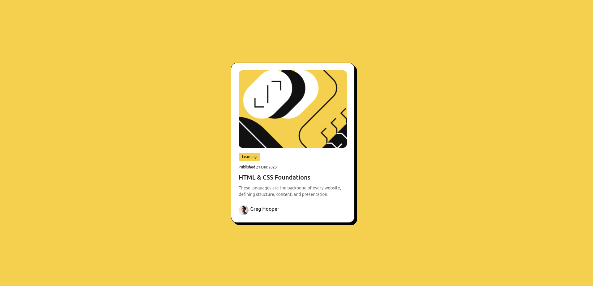

# Frontend Mentor - Blog preview card solution

This is a solution to the [Blog preview card challenge on Frontend Mentor](https://www.frontendmentor.io/challenges/blog-preview-card-ckPaj01IcS). Frontend Mentor challenges help you improve your coding skills by building realistic projects.

## Table of contents

- [Overview](#overview)
  - [The challenge](#the-challenge)
  - [Screenshot](#screenshot)
  - [Links](#links)
- [My process](#my-process)
  - [Built with](#built-with)
  - [What I learned](#what-i-learned)
  - [Continued development](#continued-development)
  - [Useful resources](#useful-resources)
- [Author](#author)
- [Acknowledgments](#acknowledgments)

## Overview

### The challenge

Users should be able to:

- See hover and focus states for all interactive elements on the page.

### Screenshot

### Links

- Solution URL: [GitHub Repository](https://github.com/TedJenkler/Card-Bootstrap-SCSS)
- Live Site URL: [Live Demo](https://bootstrap-scss-card-tedjenkler.netlify.app/)

## My process

### Built with

- [Vite](https://vitejs.dev/) - A frontend build tool for fast development with a modern workflow.
- [React](https://reactjs.org/) - A JavaScript library for building user interfaces.
- [SCSS](https://sass-lang.com/documentation) - For advanced styling and creating flexible, maintainable stylesheets.
- [Bootstrap](https://getbootstrap.com/docs/) - For UI components and responsive design utilities.

### What I learned

During this project, I gained more experience in the following areas:

- **SCSS:** Enhanced understanding of SCSS features like mixins, maps, variables, and responsive design.
- **Bootstrap:** Improved skills in utilizing Bootstrap for rapid UI development and responsive design.

### Continued development

In future projects, I plan to:

- Explore more complex SCSS techniques and further streamline my stylesheets.
- Dive deeper into Bootstrap customization to create more unique designs while leveraging its grid system and components.

### Useful resources

- [Bootstrap Documentation](https://getbootstrap.com/docs/) - For UI components and responsive design utilities.
- [SCSS Documentation](https://sass-lang.com/documentation) - For comprehensive details on SCSS syntax and features.
- [Vite Documentation](https://vitejs.dev/) - For setting up a fast and efficient development environment.
- [React Documentation](https://reactjs.org/docs/getting-started.html) - For learning and using React effectively.

## Author

- Frontend Mentor - [@TedJenkler](https://www.frontendmentor.io/profile/TedJenkler)
- LinkedIn - [Teodor Jenkler](https://www.linkedin.com/in/tedjenklerwebdeveloper/)
- X - [@TJenkler](https://x.com/TJenkler)
- Discord - [TedJenkler](https://discord.com/users/TedJenkler)
- YouTube - [WebDevwithTed](https://www.youtube.com/@WebDevwithTed)
